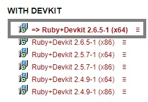
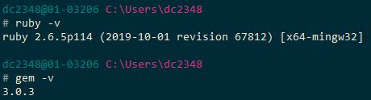
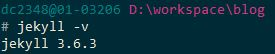
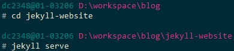
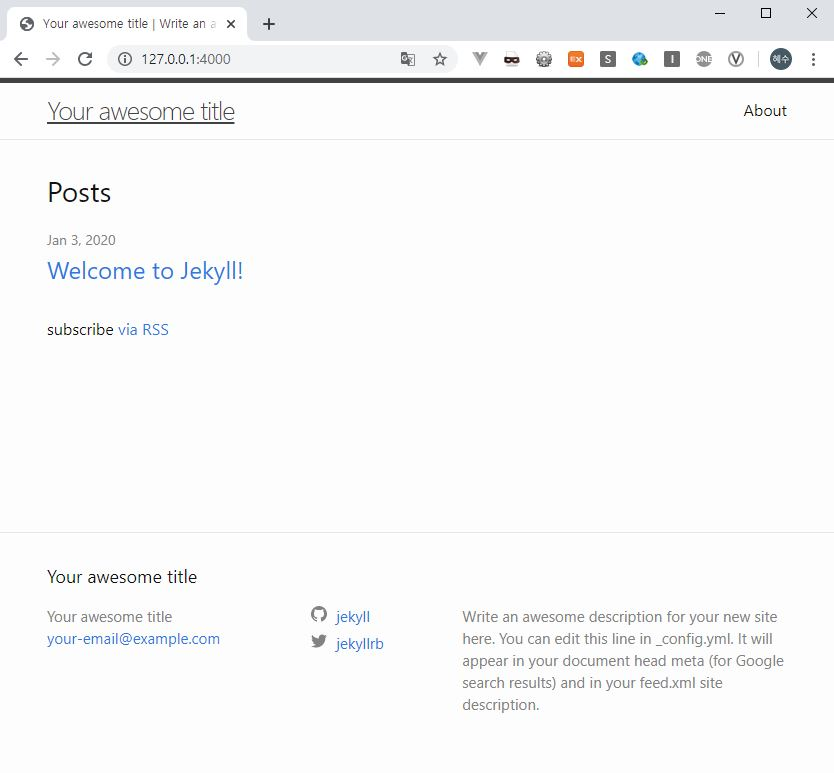

# :gem: 블로그 생성 및 운영 방법 2가지

블로그를 생성하고 운영하는 방법에는 사실 크게 2가지로 나눌 수 있다.
1. GitHub 사이트 내에서 GitHub Pages를 이용하여 생성 / GitHub 사이트 내 문서 수정을 통한 운영
    - 장점 : 최초 생성이 간편하다.
    - 단점 : 수정 결과를 확인하기 위해서는 저장(커밋) 후 블로그에 직접 들어가서 확인 필요(n번의 수정 시 n번의 커밋)
2. 로컬 환경에 Jekyll을 설치하여 프로젝트 생성 및 업로드 / 로컬 환경에서 문서 수정 후 로컬 서버 실행을 통한 테스트 후 커밋
    - 장점 : 로컬 환경에서 문서 수정 후 로컬 서버로 블로그를 바로바로 띄워볼 수 있어 편리(n번의 수정 후 1번의 커밋)
    - 단점 : Jekyll을 실행할 수 있는 최초 한번의 환경 셋팅이 필요

이해하기 쉽게 적는다고 적어보았지만 처음 보는 분들은 두 개의 차이를 명확히 느끼기 어려우실 것 같다:sob:. 선택에 도움을 드리자면 개발자가 아닌분들이나 블로그가 수정되는 경우가 많이 없다면 1번 방식을 추천하고, 개발자이고 잦은 수정이 있는 경우 2번 방식을 추천한다. 그래서 우리도 2번 방식으로 진행을 할 것이다.   
 

# :gem: Jekyll 설치하기

Jekyll을 이용하여 블로그를 생성할 경우, 최초 한번의 Jekyll 환경을 만들어주고 나면 그 뒤로는 단순한 텍스트 파일의 업로드 만으로 포스팅이 가능하다. 다시 말하면 최초 한번의 Jekyll 환경의 프로젝트를 생성하여 업로드해야 한다는 것이다.
Jekyll을 로컬에 설치하고, Jekyll 프로젝트를 생성하여, GitHub 레파지토리에 업로드하는 과정을 진행할 것이다. 그리고 Windows 10을 기준으로 설명하였다.

## :ring: Ruby 설치하기
지킬을 설치하기 위해서는 먼저 루비(ruby)와 잼(gem)이 설치되어 있어야 한다.

- [Windows용 루비 다운로드 페이지](https://rubyinstaller.org/downloads/)에 들어간다. 
- Ruby+Devkit 버전을 다운로드 받아 설치한다.

- Ruby와 Gem이 정상적으로 설치되었는지 확인한다.
    - `ruby -v`
    - `gem -v`
    - 아래와 같이 버전이 표시되면 정상적으로 설치가 된 것이다.

 

## :ring: Jekyll 설치하기
- Jekyll과 Bundler를 설치한다.
    - `gem install jekyll bundler`
- Jekyll이 정상적으로 설치되었는지 확인한다.
    - `jekyll -v`

    
 

- :bulb: 참고 : Jekyll 설치 시 Failed to build gem native extension 오류가 나는경우
현재 jekyll이 4.0.0 버전까지 나왔지만 windows 용은 하위 버전까지만 존재하기 때문에 나는 오류
    - `gem list --remote --all jekyll` 로 하위 버전 확인
    - `gem install jekyll -v 3.6.3` 로 3.6.3 버전 설치(2020.01.03 기준)
 

## :ring: 블로그 프로젝트 생성
- 기본 블로그 테마
    - `jekyll new jekyll-website`
 

## :ring: 블로그 로컬 서버 실행
- 위에서 생성한 프로젝트 폴더로 이동
    - `cd jekyll-website`
- 로컬 서버 실행
    - `jekyll serve`

- 
 

## :ring: 브라우저에서 블로그 확인
- http://127.0.0.1:4000/ 로 접속
- 블로그 정상적으로 생성됨 확인!

이렇게 로컬환경에서 블로그 생성이 완료되었다. 다음 포스팅에서는 생성된 블로그 프로젝트를 GitHub에 업로드하고 GitHub Pages를 이용하여 웹호스팅하는 방법에 대해 알아볼 예정이다.